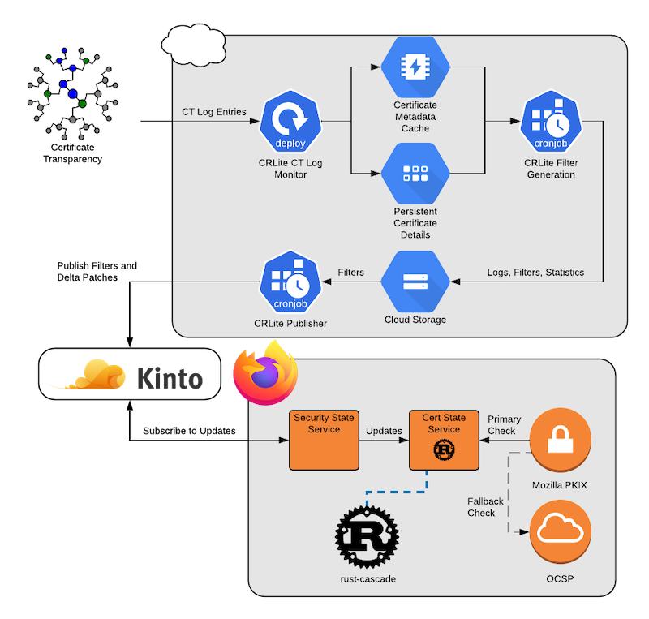
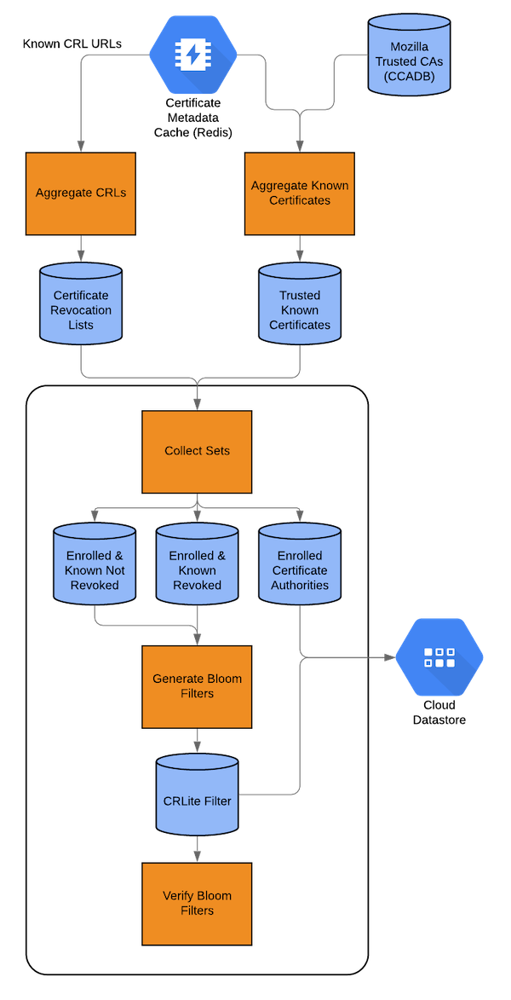
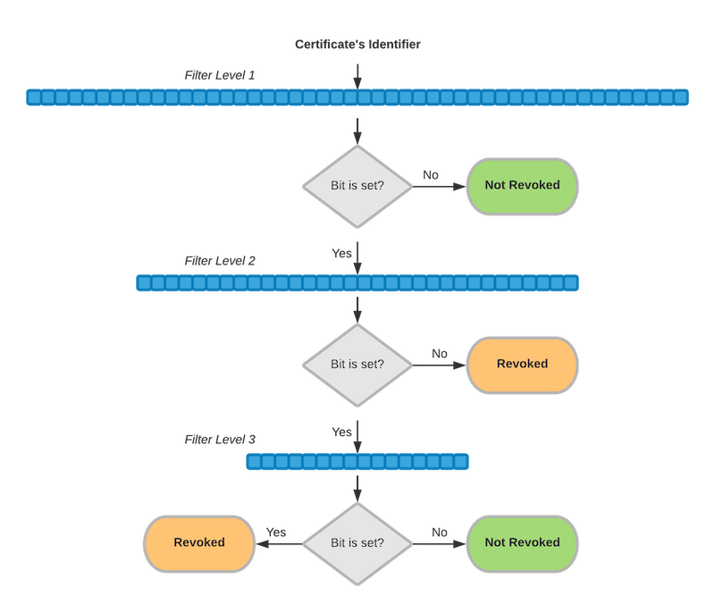
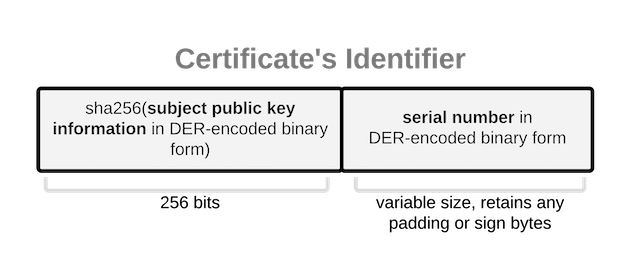

[](https://circleci.com/gh/mozilla/crlite)


CRLite uses a Bloom filter cascade [and whole-ecosystem analysis of the Web PKI](https://www.certificate-transparency.org/) to push the entire web’s TLS revocation information to Firefox clients, replacing [OCSP](https://en.wikipedia.org/wiki/Online_Certificate_Status_Protocol) for most browser TLS connections, speeding up connection time while continuing to support PKI revocations. The system was [originally proposed at IEEE S&P 2017](http://www.ccs.neu.edu/home/cbw/static/pdf/larisch-oakland17.pdf).

For details about CRLite, [Mozilla Security Engineering has a blog post series](https://blog.mozilla.org/security/tag/crlite/), and [this repository has a FAQ](https://github.com/mozilla/crlite/wiki#faq).

There are also useful end-user tools for querying CRLite: [moz_crlite_query](https://github.com/mozilla/moz_crlite_query), to query the current CRLite filter for revocations, and a diagnostic tool [crlite_status](https://github.com/jcjones/crlite_status) to monitor filter generation metrics.


## General Structure

CRLite is designed to run in Kubernetes, with the following services:

1. [`containers/crlite-fetch`](https://github.com/mozilla/crlite/tree/main/containers/crlite-fetch), a constantly-running task that downloads from Certificate Transparency logs into Redis and Google Firestore
1. [`containers/crlite-generate`](https://github.com/mozilla/crlite/tree/main/containers/crlite-generate), a periodic (cron) job that produces a CRLite filter from the data in Redis and uploads the artifacts into Google Cloud Storage
1. [`containers/crlite-publish`](https://github.com/mozilla/crlite/tree/main/containers/crlite-publish), a periodic (cron) job that publishes the results of a `crlite-generate` run to a Kinto instance.
1. [`containers/crlite-signoff`](https://github.com/mozilla/crlite/tree/main/containers/crlite-signoff), a periodic (cron) job that verifies and approves data `crlite-publish` placed in a Kinto instance.

There are scripts in [`containers/`](https://github.com/mozilla/crlite/tree/main/containers) to build Docker images both using Docker, see`build-local.sh`. There are also builds at Docker Hub in the [`mozilla/crlite`](https://hub.docker.com/r/mozilla/crlite) project.


### Storage
Storage consists of these parts:

1. Redis, e.g. Google Cloud Memorystore, for certificate metadata (CRL DPs, serial numbers, expirations, issuers), used in filter generation.
1. Google Cloud Storage, for storage of the artifacts when a job is completed.
1. A local persistent disk, for persistent storage of downloaded CRLs. This is defined in [`containers/crl-storage-claim.yaml`](https://github.com/mozilla/crlite/blob/main/containers/crl-storage-claim.yaml).


### Information Flow

This tooling monitors Certificate Transparency logs and, upon secheduled execution, `crlite-generate` produces a new filter and uploads it to Cloud Storage.



The process for producing a CRLite filter, is run by [`system/crlite-fullrun`](https://github.com/mozilla/crlite/blob/main/system/crlite-fullrun), which is described in block form in this diagram:



The output Bloom filter cascade is built by the Python [`mozilla/filter-cascade`](https://github.com/mozilla/filter-cascade) tool and then read in Firefox by the Rust [`mozilla/rust-cascade`](https://github.com/mozilla/rust-cascade) package.

For complete details of the filter construction see Section III.B of the [CRLite paper](http://www.ccs.neu.edu/home/cbw/static/pdf/larisch-oakland17.pdf).



The keys used into the CRLite data structure consist of the SHA256 digest of the issuer's `Subject Public Key Information` field in DER-encoded form, followed by the the certificate's serial number, unmodified, in DER-encoded form.




## Local Installation

It's possible to run the tools locally, though you will need local instances of Redis and Firestore. First, install the tools and their dependencies

```sh
go install -u github.com/mozilla/crlite/go/cmd/ct-fetch
go install -u github.com/mozilla/crlite/go/cmd/aggregate-crls
go install -u github.com/mozilla/crlite/go/cmd/aggregate-known

pipenv install
```


### Configuration

You can configure via environment variables, or via a config file. Environment variables are specified in the [`/containers/*.properties.example`](https://github.com/mozilla/crlite/tree/main/containers) files. To use a configuration file,  `~/.ct-fetch.ini` (or any file selected on the CLI using `-config`), construct it as so:

```
persistentStorage = /persistent
numThreads = 16
cacheSize = 128
```


#### Parameters

You'll want to set a collection of configuration parameters:

* `runForever [true/false]`
* `logExpiredEntries [true/false]`
* `numThreads 16`
* `cacheSize [number of cache entries. An individual entry contains an issuer-day's worth of serial numbers, which could be as much as 64 MB of RAM, but is generally closer to 1 MB.]`
* `outputRefreshMs [milliseconds]`

The log list is all the logs you want to sync, comma separated, as URLs:
* `logList = https://ct.googleapis.com/icarus, https://oak.ct.letsencrypt.org/2021/`

To get all current ones from
[certificate-transparency.org](https://certificate-transparency.org/):
```
echo "logList = $(setup/list_all_active_ct_logs)" >> ~/.ct-fetch.ini
```

If running forever, set the delay on polling for new updates, per log. This will have some jitter added:
* `pollingDelay` [minutes]

If not running forever, you can give limits or slice up CT log data:
* `limit` [uint]
* `offset` [uint]

You'll also need to configure credentials used for Google Cloud Storage:
* `GOOGLE_APPLICATION_CREDENTIALS` [base64-encoded string of the service credentials JSON]

If you need to proxy the connection, perhaps via SSH, set the `HTTPS_PROXY` to something like `socks5://localhost:32547/"` as well.


### General Operation

[`containers/build-local.sh`](https://github.com/mozilla/crlite/tree/main/containers/build-local.sh) produces the Docker containers locally.

[`test-via-docker.sh`](https://github.com/mozilla/crlite/tree/main/test-via-docker.sh) executes a complete "run", syncing with CT and producing a filter. It's configured using a series of environment variables.

Note that since all data is stored in Redis, a robust backup for the Redis information is warranted to avoid expensive resynchronization.

### Starting the Local Dependencies

Redis can be provided in a variety of ways, easiest is probably the Redis docker distribution. For whatever reason, I have the
best luck remapping ports to make it run on 6379:
```sh
docker run -p 6379:7000 redis:4 --port 7000
```


## Running from a Docker Container

To construct a container, see [`containers/README.md`](https://github.com/mozilla/crlite/tree/main/containers/README.md).

The crlite-fetch container runs forever, fetching CT updates:

```sh
docker run --rm -it \
  -e "FIRESTORE_EMULATOR_HOST=my_ip_address:8403" \
  -e "outputRefreshMs=1000" \
  crlite:staging-fetch
```

The crlite-generate container constructs a new filter. To use local disk, set the `persistantStorage` to `/persistent` and mount that volume in Docker. You should also mount the volume `/processing` to get the output files:

```sh
docker run --rm -it \
  -e "persistentStorage=/persistent" \
  -e "outputRefreshMs=1000" \
  --mount type=bind,src=/tmp/ctlite_data,dst=/ctdata \
  --mount type=bind,src=/tmp/crlite_results,dst=/processing \
  crlite:staging-generate
```

See the [`test-via-docker.sh`](https://github.com/mozilla/crlite/blob/main/test-via-docker.sh) for an example.

To run in a remote container, such as a Kubernetes pod, you'll need to make sure to set all the environment variables properly, and the container should otherwise work. See [`containers/crlite-config.properties.example`](https://github.com/mozilla/crlite/blob/main/containers/crlite-config.properties.example) for an example of the Kubernetes environment that can be imported using `kubectl create configmap`, see the `containers` README.md for details.


## Tools

*`ct-fetch`*
Downloads all CT entries' certificates to a Firestore instance and collects their metadata.

*`aggregate-crls`*
Obtains all CRLs defined in all CT entries' certificates, verifies them, and collates their results
into `*issuer SKI base64*.revoked` files.

*`aggregate-known`*
Collates all CT entries' unexpired certificates into `*issuer SKI base64*.known` files.


## Credits

* The CRLite research team: James Larsich, David Choffnes, Dave Levin, Bruce M. Maggs, Alan Mislove, and Christo Wilson.
* Benton Case for [certificate-revocation-analysis](https://github.com/casebenton/certificate-revocation-analysis), which kicked off this effort.
* Mark Goodwin for the original Python [`filter_cascade`](https://gist.githubusercontent.com/mozmark/c48275e9c07ccca3f8b530b88de6ecde/raw/19152f7f10925379420aa7721319a483273d867d/sample.py) and the [`filter-cascade`](https://github.com/mozilla/filter-cascade) project.
* Dana Keeler and Mark Goodwin together for the Rust [`rust-cascade`](https://github.com/mozilla/rust-cascade).
